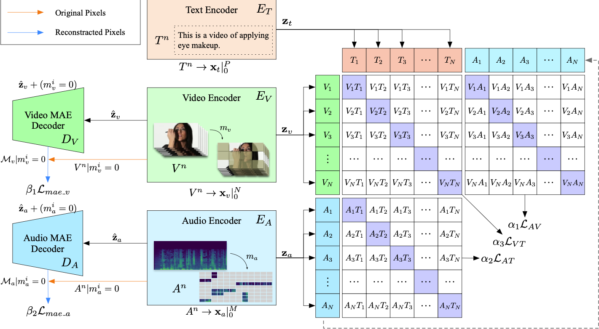

# Contrastive Video-Language-Audio Pre-training with Masked AutoEncoders


This Paper is submitted to Pattern Recognition (PR) Journal, and is currently under review. To facilitate the review process, key components of the code have been uploaded in the interim.

The complete codebase is currently being organized and cleaned up. The full codebase will be made publicly available upon acceptance and publication of the paper, for the benefit of the research community.


---



---

## Project Structure

```
main.py
config/
  pretraining/          Pre-training configs (9)
  finetuning/           Fine-tuning configs (17)
  zeroshot/             Zero-shot configs (2)
scripts/
  pretraining/
    _pretraining_core.py    Core: Trainers / ProjectedEncoder / utilities
    Pretrain_CVLAP_MAE.py   Video+Audio+Text contrastive + MAE (all variants, symmetric & asymmetric)
    Pretrain_CVLAP.py       Video+Audio+Text contrastive only (no MAE)
    Pretrain_VideoText_CVLAP_MAE.py   Video+Text contrastive + Video MAE (no audio)
  finetuning/
    _finetuning_core.py     Core: BaseFinetuneTrainer / checkpoint loading
    Finetune_UCF101.py      UCF-101 fine-tuning (with or without audio)
    Finetune_HMDB51.py      HMDB-51 fine-tuning
    Finetune_SSv2.py        Something-Something v2 fine-tuning
  zeroshot/
    ZeroShot_HMDB51.py      HMDB-51 zero-shot evaluation
modelling/                  Encoders (ViViT / AST / CLIP-Text) and MAE decoders
data/                       Datasets and dataloaders
utils/
```

---

## Design Overview

Each config YAML contains two key fields:

| Field | Purpose |
|-------|---------|
| `name` | Experiment name (used for checkpoint directory and WandB run name) |
| `script` | Consolidated script class name (determines which Python class to run) |

`main.py` reads the `script` field to dynamically import `scripts.<task>.<script>`. For backward compatibility, it falls back to `name` if `script` is absent.

---

## Key Config Parameters

| Parameter | Description | Example Values |
|-----------|-------------|----------------|
| `arch` | Encoder size | `'base'` / `'large'` |
| `subset_ratio` | Fraction of Kinetics-400 to use | `0.62` / `1.0` |
| `mask_ratio` | MAE masking ratio | `0.75` |
| `share_encoder_params` | Share Video/Audio encoder parameters | `true` / `false` |
| `projected_modality` | Which modality uses a linear projection (asymmetric architecture) | `'none'` / `'video'` / `'audio'` / `'text'` |
| `use_audio` | Use audio features during fine-tuning | `true` / `false` |
| `video_was_projected` | Whether the video encoder was projected during pre-training (affects weight loading) | `true` / `false` |
| `audio_was_projected` | Whether the audio encoder was projected during pre-training | `true` / `false` |

---

All rights reserved by the authors and Massey University, New Zealand. 
